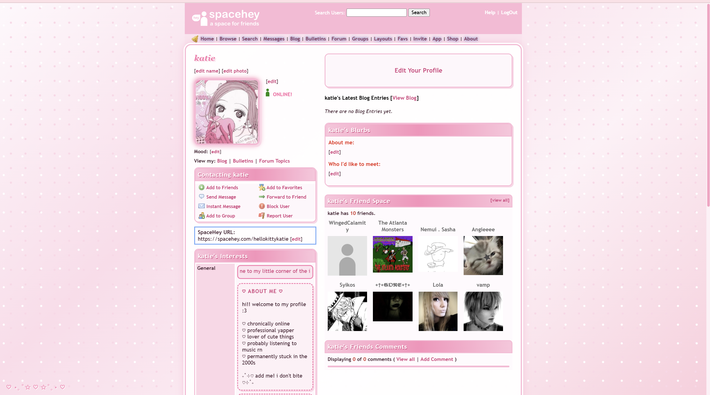

# ♡ Pink & White SpaceHey Theme ♡

A cute pink and white SpaceHey profile theme with soft Y2K-inspired styling.

## ✧ Features

* Pink and white gradient background
* Cute rounded profile boxes
* Pink navigation bar
* Custom scrollbar
* Pink profile picture border
* Soft pink headings
* Cute floating hearts and stars
* Custom link hover effects
* Pink and white comment section

## ♡ How to Use

1. Open the `style.css` file.
2. Copy all of the CSS.
3. Go to your SpaceHey profile.
4. Click **Edit Profile**.
5. Go to your **About Me** section.
6. Paste the CSS between these tags:

```html
<style>

PASTE CSS HERE

</style>
```

7. Save your profile.

## ✧ Customizing the Colors

The main colors are located near the top of the CSS:

```css
:root {
  --dark: #4b2637;
  --black: #2a1720;
  --pink: #ffb7d5;
  --hotpink: #ff75ad;
  --lightpink: #ffe3ef;
  --white: #fff9fc;
}
```

Change the hex codes to create your own version.


## ♡ Preview



## ✧ Credit

Made by Katie ♡

Feel free to use and customize this layout for your own SpaceHey profile.

If you modify and redistribute the theme, credit is appreciated.
